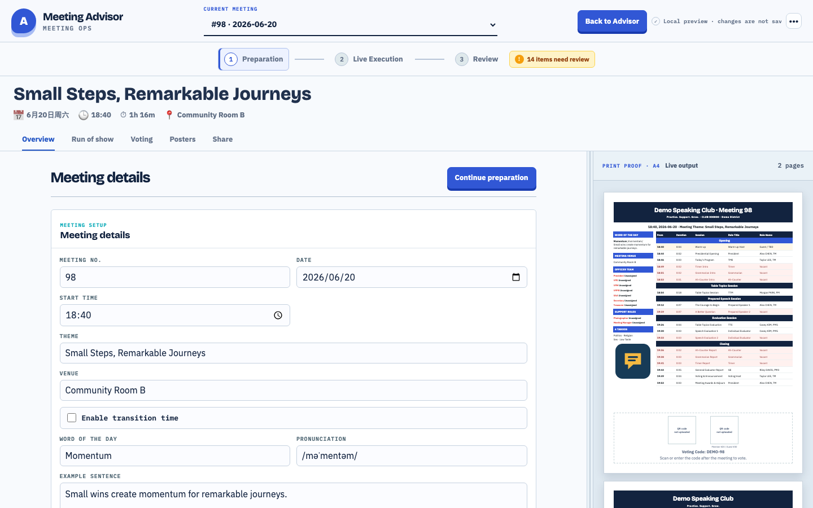

# Club Meeting Ops

一份会议数据连接角色预约、会前准备、Agenda、Presentation、Voting、
Awards 与会后复盘。目标：议程只改一次，不再逐个同步页面、表格和材料。

本项目为独立开源项目，不隶属于任何演讲俱乐部组织或雇主，也不代表其背书。

[English README](README.md)



## 五分钟预览

要求：Node.js 22+、npm。

```bash
npm ci --ignore-scripts
npm run dev
```

打开终端输出地址并加 `?preview=1`：

```text
http://localhost:5173/?preview=1
```

Preview 只使用虚构数据，不登录、不写 Base。

## 主要能力

- 根据个人目标预约未来会议角色。
- 编辑会议、Agenda 区块、角色、演讲和学习路径。
- 输出两页 A4 Agenda 与现场 Presentation。
- 准备投票、确认奖项、展示证书。
- 检查会前风险并完成会后质量复盘。
- 通过 MCP 读取会议；Draft Agenda 修改和角色预约受显式授权、确认、审计与版本检查保护。

## 架构

```text
浏览器
  │ 同源 /api
  ▼
Node.js Functions ── 仅服务端凭证 ── 飞书/Lark Base
  │
  ├─ Meetings / Blocks / Items / Members
  ├─ Templates / RoleCatalog / Assets / 推荐状态
  └─ 独立 Voting Base
```

浏览器 bundle 不包含 Base 凭证。每个俱乐部独立部署实例、Base、Session
Secret 与口令。

## 修改俱乐部信息

编辑 [`club-profile.js`](club-profile.js)。这里只放可公开信息：俱乐部名、
编号、区域、口号、自制 Logo、网站、Agenda 页脚、奖项名称、公开 MCP 地址
与介绍文案。

不要写密钥或会员数据。

## 完整本地环境

1. 创建自己的飞书/Lark 应用和空 Base。
2. 阅读 [`docs/BASE_SCHEMA.md`](docs/BASE_SCHEMA.md)。
3. 复制 `.env.example` 为 `.env.local`。
4. 只填写你自己的测试资源。
5. 生成口令 hash：

```bash
node -e 'const c=require("node:crypto"),s=c.randomBytes(16).toString("hex");process.stdout.write("scrypt$"+s+"$"+c.scryptSync(process.argv[1],s,32).toString("hex")+"\n")' 'choose-a-passcode'
```

分别生成 `AGENDA_EDIT_PASSCODE_HASH` 与 `BOOKING_PASSCODE_HASH`。

6. 生成 `AGENDA_SESSION_SECRET`：

```bash
node -e 'console.log(require("node:crypto").randomBytes(32).toString("hex"))'
```

7. 检查配置；脚本只显示变量是否存在，不打印值：

```bash
set -a
. ./.env.local
set +a
python3 scripts/diagnose-env.py
```

8. 启动：

```bash
npm run dev
```

9. 打开 `http://localhost:5173/api/health`。返回
`persistence: "bitable-ready"` 表示必需 Base 变量齐全。

## Base Schema 与 Demo 数据

[`docs/demo-data.json`](docs/demo-data.json) 全部为虚构数据。禁止导入生产会员
名单或真实会议导出。

Schema 脚本默认 dry-run：

```bash
python3 scripts/create-bitable-tables.py
python3 scripts/create-bitable-tables.py --apply
```

`--apply` 会修改环境变量指定的 Base。先核对目标。已有实例可加
`--items-only` 或 `--optimize-lookups`。

## Voting Base

Voting 使用独立 Base，并设置 `BITABLE_VOTING_APP_TOKEN`。预建池默认也只
dry-run：

```bash
npm run provision:voting-pool
npm run provision:voting-pool -- --apply
```

无关俱乐部不能共享 Voting Base。

## 集成测试

```bash
npm run test:integration
```

该命令会创建、更新并清理临时记录。只能连接专用测试 Base，不能连接生产。

## 部署到 Vercel

1. Fork 本仓库。
2. 在 Vercel 新建项目并导入 fork。
3. 使用 Vite 默认值：`npm run build`，输出 `dist`。
4. 将 `.env.example` 变量配置到服务端环境，并把 `PUBLIC_APP_ORIGIN`
   设置为不带路径的公开 HTTPS Origin。
5. 使用全新 Base 和全新密钥。
6. 部署后检查 `/api/health`。

Preview 部署使用隔离测试资源或无持久化模式。Fork PR 不注入生产密钥。

## 本地验收

```bash
npm ci --ignore-scripts
npm run check:public
npm test
npm run build
npm audit --omit=dev --audit-level=high
git diff --check
```

PR、`main` push、`v*` tag 都执行同类质量和安全门禁。普通 CI 不运行写入型
集成测试。

## 安全边界

- `.env*`、`.vercel/`、私有数据、artifacts、临时输出均被忽略。
- `scripts/check-public-safety.mjs` 拒绝凭证、个人路径、实例标识和未审核素材。
- GitHub Actions 只读，外部 Action 固定完整 SHA。
- 漏洞请使用 GitHub 私密漏洞报告。

详见 [SECURITY.md](SECURITY.md)、[CONTRIBUTING.md](CONTRIBUTING.md)、
[PUBLIC_FILES.md](PUBLIC_FILES.md) 和
[THIRD_PARTY_NOTICES.md](THIRD_PARTY_NOTICES.md)。

## 协议

MIT，见 [LICENSE](LICENSE)。
